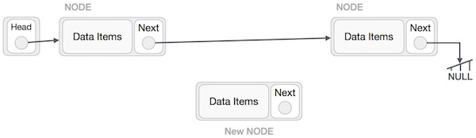
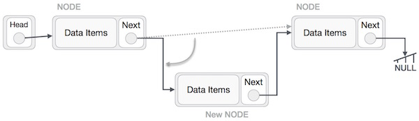
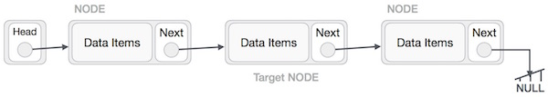
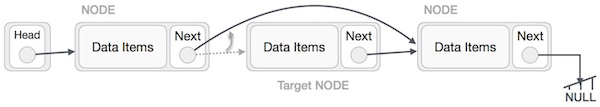
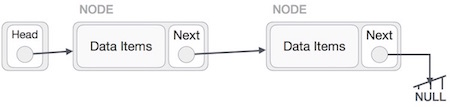

# 1. ArrayList (Review)

## 1. Another look at Array

`Array` is a collection of data, with fixed size. Due to the fact that we cannot change its size, it is good to be used in certain situations when the size of the data should be fixed, for example frames of a video, a go game gameboard, or sudoku games. But in a situation that you should change the size of the collection frequently, array is not the best choice, cause every time you want to add a new data, you have to create a new piece of memory to store the data, then copy everything you have, to the new memory, then add the new data in the end. The same when you want to delete some data.

Why arrays behaves like this is because elements are **continuously** stored in an array, and it brings both pro and con at the same time.

- **Pro**: Since the elements are continuously stored in an array, it would be **easy to calculate the address of each element**. For example: for array `int[] nums = {1, 2, 3};` , assume the address of the array is `aa`, then the address of the first element is also `aa`, and because it is an `int` array, each element would take 4 bytes space, so the address of the second element is `aa + 4`, and the address of the third element is `aa + 8`, the address of element at index `n` (if exists) would be `aa + 4 * n`. In this case, **since we can easily calculate the address of an element, it would be really quick to read and modify it**.
- **Con** To keep all elements next to each other in the memory is not easy, especially when we want to add or remove an element. Same example: `int[] nums = {1, 2, 3};`, there are 3 elements in the array, if we want to add a new element to it, we have to create a new array with length of 4, then copy the 3 elements to it, then we can add the new element in the end. And if we want to remove the element `2`, we have to create a new array with length of 2, then copy the element `1` to it, and then copy the element `3` to it. This creating new array and copying will take a lot of time, especially when you want to add or remove many elements.

## 2. What is ArrayList

`ArrayList` is very similar to `Array`, **elements inside are also continuously stored. Thus it has the same pro and con as array (good at reading and writing an element, bad at adding or removing an element)**. However, `ArrayList` belongs to a bigger "family" `List`, which contains many pre-exists methods that we can directly use, for example methods to add a new element and methods to remove an existed element. Most importantly, those methods are optimized, so **ArrayList is much easier to use for adding or removing elements comparing with array**.

### 2.1 Concept of capacity

Each ArrayList has an attribute `capacity` to indicate how many elements it can hold. Notice: `capacity` does not indicates the number of elements an ArrayList has. You can understand ArrayList as a bag with a specific volume, for example you can put 10 books inside at most. It does not mean there are 10 books in the bag already, there can be 1 book or 8 books or no books inside, and that won't affect the capacity of the bag.

An array can also be understood as a bag too, however, the bag is always full, if the capacity is 10, then it will be automatically filled by 10 elements, so you may feel the capacity and the number of elements are the same. However, the ArrayList can have some empty space, so the capacity and the number of elements are not necessary the same. Only when the ArrayList is full, then the capacity equals the number of elements.

### 2.2 Why ArrayList is better than Array for inserting

If the number of elements is not equal to the capacity of an array, it means there are some free but "reserved" space in the ArrayList. You can directly add a new element into the reserved place without creating a new ArrayList. For example, if the capacity of an ArrayList is 10, but it only contains 2 elements, then you can add 8 elements to it without creating a new ArrayList. This will save many times since there is no memory allocating and copying. Only when the capacity is full, like there are 10 elements in the ArrayList so there is no more free space in the ArrayList, then if you want to add a new element, Java will create a new ArrayList, **with the capacity twice as big as the original one** (that would be 20 if the capacity of the original one is 10), and then copy the original 10 elements into the new ArrayList. In this case, there will be 10 free spaces for later use. When the new ArrayList with capacity of 20 is full again, Java will create a new ArrayList of capacity of 40 and copy the original 20 elements into it so it has another 20 free space to use.

## 3 Creating an ArrayList

ArrayList is pre-defined class in Java, so if you want to create an ArrayList, you can directly use its constructor

```java
// not suggested, has no data type restriction
ArrayList al1 = new ArrayList();            // array list of Objects
al1.add(1);                                 // elements can be anything
al1.add(1.1);
al1.add("hello");

// suggested, with data type restriction in <>, you can only put a class in the <>
// you can add Integer to both <> before and after the '=',
// or you can just add it before the '=' if you have two <>
// when you want to create an empty ArrayList, use new constructor
ArrayList<Integer> al2 = new ArrayList<>();          // capacity = 10, but no elements inside
ArrayList<Integer> al3 = new ArrayList<>(100);       // capacity = 100, but no elements inside

// -----------------------------------------------------------
// advanced, will talk about it later in chapeter 2
// -----------------------------------------------------------

// the reference can also be List instead of ArrayList
List<Integer> l4 = new ArrayList();				   // ArrayList is a special kind of array

// when you have specific values you want to put in the ArrayList,
// first create an array with {} to list all elements,
// then use Arrays.asList() to cast the array into a List
Integer[] nums = {1, 2, 3, 1, 1, 1};     // array
List<Integer> l5 = new ArrayList(Arrays.asList(nums));
```

## 4 Methods

### 4.1 ArrayList methods:

ArrayList methods is a pre-existed class with many useful methods inside:

```java
// Assume we have an ArrayList with 1, 2, 3 inside
Integer[] nums = {1, 2, 3};
List<Integer> list = new ArrayList<>(Arrays.asList(nums));
```

| Method                      | Usage                                                                             | Example                                                  |
| --------------------------- | --------------------------------------------------------------------------------- | -------------------------------------------------------- |
| `al.size()`                 | check the number of elements in an ArrayList                                      | `list.size()` returns `3`                                |
| `al.get(int idx)`           | read a specific element                                                           | `list.get(0)` returns `1`                                |
| `al.set(int idx, Object o)` | modify a specific element                                                         | `list.set(2, 9)` changes `list` to `[1, 2, 9]`           |
| `al.add(Object o)`          | append a new element in the end                                                   | `list.add(0)` changes `list` to `[1, 2, 9, 0]`           |
| `al.add(int idx, Object o)` | insert a new element at a specific position                                       | `list.add(5, 3)` changes `list` to `[1, 2, 9, 5, 0]`     |
| `al.remove(int idx)`        | remove an element at a specific position                                          | `list.remove(0)` changes `list` to `[2, 9, 5, 0]`        |
| `al.remove(Object o)`       | go through the ArrayList and remove the first appearance of the parameter element | `list.remove((Integer) 9)` changes `list` to `[2, 5, 0]` |
| `al.toString()`             | the `toString()` method for ArrayList class                                       | `list.toString()` returns `[2, 5, 0]`                    |

### 4.2 Comparation between String, array and ArrayList

|                      | String                                                          | Array                                                                                                                                              | ArrayList                                                                                                                         |
| -------------------- | --------------------------------------------------------------- | -------------------------------------------------------------------------------------------------------------------------------------------------- | --------------------------------------------------------------------------------------------------------------------------------- |
| check the length     | `str.length()`                                                  | `array.length`                                                                                                                                     | `al.size()`                                                                                                                       |
| idx -> element       | `str.chatAt()`                                                  | `array[idx]`                                                                                                                                       | `al.get(idx)`                                                                                                                     |
| element -> idx       | `str.indexOf(c)`<br />`str.lastIndexOf(c)`                      | does not exist, have to create by urself                                                                                                           | `al.indexOf(c)`                                                                                                                   |
| modifying an element | CANNOT, create a new one                                        | `array[idx] = xxx`                                                                                                                                 | `al.set(idx, value)`                                                                                                              |
| adding new element   | CANNOT, create a new one                                        | does not exist, have to create by urself                                                                                                           | `al.add(object)` -> append in the end<br />`al.add(idx, object)` -> insert at a specific position                                 |
| removing an element  | CANNOT, create a new one                                        | does not exist, have to create by urself                                                                                                           | `al.remove(idx)` -> remove an element at a specific position<br />`al.remove(object)` -> remove the first appearance of an object |
| Comparing            | `str1.equals(str2)`                                             | `Arrays.equals(array1, array2)`for 1D<br />`Arrays.deepEquals(array1, array2)` for Multi-D                                                         | `al1.equals(al2)`                                                                                                                 |
| converting to String | -                                                               | `Arrays.toString(array)` for 1-D<br />`Arrays.deepToString(array)` for Multi-D<br />Create your own method if you have specific output requirement | `al.toString()`<br />Create your own method if you have specific output requirement                                               |
| Enhanced-for         | No enhanced-for<br />You can use if you cast it to a char array | Yes                                                                                                                                                | Yes                                                                                                                               |

## 5 ArrayList VS LinkedList

`LinkedList` also belongs to the "family" `List`, and that is to say, whatever methods that ArrayList contains also exist for LinkedList.

ArrayList and LinkedList may look very similar, you can actually replace one with the other. However, the two are actually different for memory allocation.

- ArrayList: elements are `continuously` stored, so it is `good at read and modify each element`, but `bad at adding or removing elements`.

- LinkedList: elements are `not continuously` stored, so it is `bad at read and modify each element`, but `good at adding or removing elements`.

# 2. LinkedList (Introduction)

## 1. Overview

A linked list is a sequence of data structures, which are connected together via links.

Linked List is a sequence of links which contains items. Each link contains a connection to another link. Linked list is the second most-used data structure after array. Following are the important terms to understand the concept of Linked List:

- **Link** − Each link of a linked list can store a data called an element.

- **Next** − Each link of a linked list contains a link to the next link called Next.

- **LinkedList** − A Linked List contains the connection link to the first link called First.

## 2. Linked List Representation

Linked list can be visualized as a chain of nodes, where every node points to the next node.


As per the above illustration, following are the important points to be considered.

- Linked List contains a link element called first.

- Each link carries a data field(s) and a link field called next.

- Each link is linked with its next link using its next link.

- Last link carries a link as null to mark the end of the list.

## 3. Types of Linked List

Following are the various types of linked list:

- **Simple Linked List** − Item navigation is forward only.

- **Doubly Linked List** − Items can be navigated forward and backward.

- **Circular Linked List** − Last item contains link of the first element as next and the first element has a link to the last element as previous.

## 4 Basic Operations

Following are the basic operations supported by a list:

- **Insertion** − Adds an element at the beginning of the list.

- **Deletion** − Deletes an element at the beginning of the list.

- **Display** − Displays the complete list.

- **Search** − Searches an element using the given key.

- **Delete** − Deletes an element using the given key.

### 4.1. Insertion Operation

Adding a new node in linked list is a more than one step activity. We shall learn this with diagrams here. First, create a node using the same structure and find the location where it has to be inserted:



Imagine that we are inserting a node B (NewNode), between A (LeftNode) and C (RightNode). Then point B.next to C −

`NewNode.next −> RightNode`;

It should look like this −


Now, the next node at the left should point to the new node.

`LeftNode.next −> NewNode;`



This will put the new node in the middle of the two. The new list should look like this −


Similar steps should be taken if the node is being inserted at the beginning of the list. While inserting it at the end, the second last node of the list should point to the new node and the new node will point to NULL.

### 4.2. Deletion Operation

Deletion is also a more than one step process. We shall learn with pictorial representation. First, locate the target node to be removed, by using searching algorithms.



The left (previous) node of the target node now should point to the next node of the target node −

`LeftNode.next −> TargetNode.next;`



This will remove the link that was pointing to the target node. Now, using the following code, we will remove what the target node is pointing at.

`TargetNode.next −> NULL;`


We need to use the deleted node. We can keep that in memory otherwise we can simply deallocate memory and wipe off the target node completely.



### 4.3. Reverse Operation

This operation is a thorough one. We need to make the last node to be pointed by the head node and reverse the whole linked list.


First, we traverse to the end of the list. It should be pointing to NULL. Now, we shall make it point to its previous node −


We have to make sure that the last node is not the last node. So we'll have some temp node, which looks like the head node pointing to the last node. Now, we shall make all left side nodes point to their previous nodes one by one.


Except the node (first node) pointed by the head node, all nodes should point to their predecessor, making them their new successor. The first node will point to NULL.


We'll make the head node point to the new first node by using the temp node.


# 3. Nested Classes

The Java programming language allows you to define a class within another class. Such a class is called a nested class and is illustrated here:

```java
class OuterClass {
    ...
    class NestedClass {
        ...
    }
}
```

**Terminology:** Nested classes are divided into two categories: non-static and static. Non-static nested classes are called inner classes. Nested classes that are declared static are called static nested classes.

```java
class OuterClass {
    ...
    class InnerClass {
        ...
    }
    static class StaticNestedClass {
        ...
    }
}
```

A nested class is a member of its enclosing class. Non-static nested classes (inner classes) have access to other members of the enclosing class, even if they are declared private. Static nested classes do not have access to other members of the enclosing class. As a member of the OuterClass, a nested class can be declared private, public, protected, or package private. (Recall that outer classes can only be declared public or package private.)

## 1. Why use Nested Classes?

Compelling reasons for using nested classes include the following:

**It is a way of logically grouping classes that are only used in one place:** If a class is useful to only one other class, then it is logical to embed it in that class and keep the two together. Nesting such "helper classes" makes their package more streamlined.

**It increases encapsulation:** Consider two top-level classes, A and B, where B needs access to members of A that would otherwise be declared private. By hiding class B within class A, A's members can be declared private and B can access them. In addition, B itself can be hidden from the outside world.

**It can lead to more readable and maintainable code:** Nesting small classes within top-level classes places the code closer to where it is used.

## 2. Inner Classes

As with instance methods and variables, an inner class is associated with an instance of its enclosing class and has direct access to that object's methods and fields. Also, because an inner class is associated with an instance, it cannot define any static members itself.

Objects that are instances of an inner class exist within an instance of the outer class. Consider the following classes:

```java
class OuterClass {
    ...
    class InnerClass {
        ...
    }
}
```

An instance of InnerClass can exist only within an instance of OuterClass and has direct access to the methods and fields of its enclosing instance.

To instantiate an inner class, you must first instantiate the outer class. Then, create the inner object within the outer object with this syntax:

```java
OuterClass outerObject = new OuterClass();
OuterClass.InnerClass innerObject = outerObject.new InnerClass();
```

There are two special kinds of inner classes: **local classes** and **anonymous classes**.

## 3. Static Nested Classes

As with class methods and variables, a static nested class is associated with its outer class. And like static class methods, a static nested class cannot refer directly to instance variables or methods defined in its enclosing class: it can use them only through an object reference. Inner Class and Nested Static Class Example demonstrates this.

**Note:** A static nested class interacts with the instance members of its outer class (and other classes) just like any other top-level class. In effect, a static nested class is behaviorally a top-level class that has been nested in another top-level class for packaging convenience. Inner Class and Nested Static Class Example also demonstrates this.

You instantiate a static nested class the same way as a top-level class:

```java
StaticNestedClass staticNestedObject = new StaticNestedClass();
```

## 4. Inner Class and Nested Static Class Example

The following example, OuterClass, along with TopLevelClass, demonstrates which class members of OuterClass an inner class (InnerClass), a nested static class (StaticNestedClass), and a top-level class (TopLevelClass) can access:

**OuterClass.java**

```java
public class OuterClass {

    String outerField = "Outer field";
    static String staticOuterField = "Static outer field";

    class InnerClass {
        void accessMembers() {
            System.out.println(outerField);
            System.out.println(staticOuterField);
        }
    }

    static class StaticNestedClass {
        void accessMembers(OuterClass outer) {
            // Compiler error: Cannot make a static reference to the non-static
            //     field outerField
            // System.out.println(outerField);
            System.out.println(outer.outerField);
            System.out.println(staticOuterField);
        }
    }

    public static void main(String[] args) {
        System.out.println("Inner class:");
        System.out.println("------------");
        OuterClass outerObject = new OuterClass();
        OuterClass.InnerClass innerObject = outerObject.new InnerClass();
        innerObject.accessMembers();

        System.out.println("\nStatic nested class:");
        System.out.println("--------------------");
        StaticNestedClass staticNestedObject = new StaticNestedClass();
        staticNestedObject.accessMembers(outerObject);

        System.out.println("\nTop-level class:");
        System.out.println("--------------------");
        TopLevelClass topLevelObject = new TopLevelClass();
        topLevelObject.accessMembers(outerObject);
    }
}
```

**TopLevelClass.java**

```java
public class TopLevelClass {

    void accessMembers(OuterClass outer) {
        // Compiler error: Cannot make a static reference to the non-static
        //     field OuterClass.outerField
        // System.out.println(OuterClass.outerField);
        System.out.println(outer.outerField);
        System.out.println(OuterClass.staticOuterField);
    }
}
```

This example prints the following output:

```
Inner class:
------------
Outer field
Static outer field

Static nested class:
--------------------
Outer field
Static outer field

Top-level class:
--------------------
Outer field
Static outer field
```

Note that a static nested class interacts with the instance members of its outer class just like any other top-level class. The static nested class StaticNestedClass can't directly access outerField because it's an instance variable of the enclosing class, OuterClass. The Java compiler generates an error at the highlighted statement:

```java
static class StaticNestedClass {
    void accessMembers(OuterClass outer) {
       // Compiler error: Cannot make a static reference to the non-static
       //     field outerField
       System.out.println(outerField);
    }
}
```

To fix this error, access outerField through an object reference:

```java
System.out.println(outer.outerField);
```

Similarly, the top-level class TopLevelClass can't directly access outerField either.

## 5. Shadowing

If a declaration of a type (such as a member variable or a parameter name) in a particular scope (such as an inner class or a method definition) has the same name as another declaration in the enclosing scope, then the declaration shadows the declaration of the enclosing scope. You cannot refer to a shadowed declaration by its name alone. The following example, ShadowTest, demonstrates this:

```java
public class ShadowTest {

    public int x = 0;

    class FirstLevel {

        public int x = 1;

        void methodInFirstLevel(int x) {
            System.out.println("x = " + x);
            System.out.println("this.x = " + this.x);
            System.out.println("ShadowTest.this.x = " + ShadowTest.this.x);
        }
    }

    public static void main(String... args) {
        ShadowTest st = new ShadowTest();
        ShadowTest.FirstLevel fl = st.new FirstLevel();
        fl.methodInFirstLevel(23);
    }
}
```

The following is the output of this example:

```
x = 23
this.x = 1
ShadowTest.this.x = 0
```

This example defines three variables named x: the member variable of the class ShadowTest, the member variable of the inner class FirstLevel, and the parameter in the method methodInFirstLevel. The variable x defined as a parameter of the method methodInFirstLevel shadows the variable of the inner class FirstLevel. Consequently, when you use the variable x in the method methodInFirstLevel, it refers to the method parameter. To refer to the member variable of the inner class FirstLevel, use the keyword this to represent the enclosing scope:

```
System.out.println("this.x = " + this.x);
```

Refer to member variables that enclose larger scopes by the class name to which they belong. For example, the following statement accesses the member variable of the class ShadowTest from the method methodInFirstLevel:

```
System.out.println("ShadowTest.this.x = " + ShadowTest.this.x);
```

## 6. Serialization

Serialization of inner classes, including local and anonymous classes, is strongly discouraged. When the Java compiler compiles certain constructs, such as inner classes, it creates synthetic constructs; these are classes, methods, fields, and other constructs that do not have a corresponding construct in the source code. Synthetic constructs enable Java compilers to implement new Java language features without changes to the JVM. However, synthetic constructs can vary among different Java compiler implementations, which means that .class files can vary among different implementations as well. Consequently, you may have compatibility issues if you serialize an inner class and then deserialize it with a different JRE implementation.

# 4. Local Classes

Local classes are classes that are defined in a block, which is a group of zero or more statements between balanced braces. You typically find local classes defined in the body of a method.

## 4.1. Declaring Local Classes

You can define a local class inside any block. For example, you can define a local class in a method body, a for loop, or an if clause.

The following example, LocalClassExample, validates two phone numbers. It defines the local class PhoneNumber in the method validatePhoneNumber:

```java
public class LocalClassExample {

    static String regularExpression = "[^0-9]";

    public static void validatePhoneNumber(
        String phoneNumber1, String phoneNumber2) {

        final int numberLength = 10;

        // Valid in JDK 8 and later:

        // int numberLength = 10;

        class PhoneNumber {

            String formattedPhoneNumber = null;

            PhoneNumber(String phoneNumber){
                // numberLength = 7;
                String currentNumber = phoneNumber.replaceAll(
                  regularExpression, "");
                if (currentNumber.length() == numberLength)
                    formattedPhoneNumber = currentNumber;
                else
                    formattedPhoneNumber = null;
            }

            public String getNumber() {
                return formattedPhoneNumber;
            }

            // Valid in JDK 8 and later:

//            public void printOriginalNumbers() {
//                System.out.println("Original numbers are " + phoneNumber1 +
//                    " and " + phoneNumber2);
//            }
        }

        PhoneNumber myNumber1 = new PhoneNumber(phoneNumber1);
        PhoneNumber myNumber2 = new PhoneNumber(phoneNumber2);

        // Valid in JDK 8 and later:

//        myNumber1.printOriginalNumbers();

        if (myNumber1.getNumber() == null)
            System.out.println("First number is invalid");
        else
            System.out.println("First number is " + myNumber1.getNumber());
        if (myNumber2.getNumber() == null)
            System.out.println("Second number is invalid");
        else
            System.out.println("Second number is " + myNumber2.getNumber());

    }

    public static void main(String... args) {
        validatePhoneNumber("123-456-7890", "456-7890");
    }
}
```

The example validates a phone number by first removing all characters from the phone number except the digits 0 through 9. After, it checks whether the phone number contains exactly ten digits (the length of a phone number in North America). This example prints the following:

```
First number is 1234567890
Second number is invalid
```

# 5. Anonymous Classes

Anonymous classes enable you to make your code more concise. They enable you to declare and instantiate a class at the same time. They are like local classes except that they do not have a name. Use them if you need to use a local class only once.

## 5.1. Declaring Anonymous Classes

While local classes are class declarations, anonymous classes are expressions, which means that you define the class in another expression. The following example, HelloWorldAnonymousClasses, uses anonymous classes in the initialization statements of the local variables frenchGreeting and spanishGreeting, but uses a local class for the initialization of the variable englishGreeting:

```java
public class HelloWorldAnonymousClasses {

    interface HelloWorld {
        public void greet();
        public void greetSomeone(String someone);
    }

    public void sayHello() {

        class EnglishGreeting implements HelloWorld {
            String name = "world";
            public void greet() {
                greetSomeone("world");
            }
            public void greetSomeone(String someone) {
                name = someone;
                System.out.println("Hello " + name);
            }
        }

        HelloWorld englishGreeting = new EnglishGreeting();

        HelloWorld frenchGreeting = new HelloWorld() {
            String name = "tout le monde";
            public void greet() {
                greetSomeone("tout le monde");
            }
            public void greetSomeone(String someone) {
                name = someone;
                System.out.println("Salut " + name);
            }
        };

        HelloWorld spanishGreeting = new HelloWorld() {
            String name = "mundo";
            public void greet() {
                greetSomeone("mundo");
            }
            public void greetSomeone(String someone) {
                name = someone;
                System.out.println("Hola, " + name);
            }
        };
        englishGreeting.greet();
        frenchGreeting.greetSomeone("Fred");
        spanishGreeting.greet();
    }

    public static void main(String... args) {
        HelloWorldAnonymousClasses myApp =
            new HelloWorldAnonymousClasses();
        myApp.sayHello();
    }
}
```

### 5.2. Syntax of Anonymous Classes

As mentioned previously, an anonymous class is an expression. The syntax of an anonymous class expression is like the invocation of a constructor, except that there is a class definition contained in a block of code.

Consider the instantiation of the frenchGreeting object:

```java
 HelloWorld frenchGreeting = new HelloWorld() {
            String name = "tout le monde";
            public void greet() {
                greetSomeone("tout le monde");
            }
            public void greetSomeone(String someone) {
                name = someone;
                System.out.println("Salut " + name);
            }
        };
```

The anonymous class expression consists of the following:

- The new operator

- The name of an interface to implement or a class to extend. In this example, the anonymous class is implementing the interface HelloWorld.

- Parentheses that contain the arguments to a constructor, just like a normal class instance creation expression. Note: When you implement an interface, there is no constructor, so you use an empty pair of parentheses, as in this example.

- A body, which is a class declaration body. More specifically, in the body, method declarations are allowed but statements are not.

Because an anonymous class definition is an expression, it must be part of a statement. In this example, the anonymous class expression is part of the statement that instantiates the frenchGreeting object. (This explains why there is a semicolon after the closing brace.)

# 6. Lambda Expressions

One issue with anonymous classes is that if the implementation of your anonymous class is very simple, such as an interface that contains only one method, then the syntax of anonymous classes may seem unwieldy and unclear. In these cases, you're usually trying to pass functionality as an argument to another method, such as what action should be taken when someone clicks a button. Lambda expressions enable you to do this, to treat functionality as method argument, or code as data.

The previous section, Anonymous Classes, shows you how to implement a base class without giving it a name. Although this is often more concise than a named class, for classes with only one method, even an anonymous class seems a bit excessive and cumbersome. Lambda expressions let you express instances of single-method classes more compactly.

## 6.1. Syntax of Lambda Expressions

A lambda expression consists of the following:

- A comma-separated list of formal parameters enclosed in parentheses.

  **Note:** You can omit the data type of the parameters in a lambda expression. In addition, you can omit the parentheses if there is only one parameter.

- The arrow token, ->

- A body, which consists of a single expression or a statement block.

Note that a lambda expression looks a lot like a method declaration; you can consider lambda expressions as anonymous methods—methods without a name.

The following example, Calculator, is an example of lambda expressions that take more than one formal parameter:

```java

public class Calculator {

    interface IntegerMath {
        int operation(int a, int b);
    }

    public int operateBinary(int a, int b, IntegerMath op) {
        return op.operation(a, b);
    }

    public static void main(String... args) {

        Calculator myApp = new Calculator();
        IntegerMath addition = (a, b) -> a + b;
        IntegerMath subtraction = (a, b) -> a - b;
        System.out.println("40 + 2 = " +
            myApp.operateBinary(40, 2, addition));
        System.out.println("20 - 10 = " +
            myApp.operateBinary(20, 10, subtraction));
    }
}
```

The method operateBinary performs a mathematical operation on two integer operands. The operation itself is specified by an instance of IntegerMath. The example defines two operations with lambda expressions, addition and subtraction. The example prints the following:

```
40 + 2 = 42
20 - 10 = 10
```

## 6.2 Serialization

You can serialize a lambda expression if its target type and its captured arguments are serializable. However, like inner classes, the serialization of lambda expressions is strongly discouraged.

# 7. Stream Processing

Streams bring functional programming to Java, and are supported starting in Java 8. A stream pipeline consists of a source, followed by zero or more intermediate operations and a terminal operation.

Some advantages of Streams:

- Will make you a more efficient Java programmer
- Make heavy use of lamda expressions
- Uses lazy evaluation to reduce memory consumption (see examples)
- And more.

Also, Java 8 Streams should not be confused with Java I/O streams (ex: FileInputStream etc); these have very little to do with each other.

Simply put, streams are wrappers around a data source, allowing us to operate with that data source and making bulk processing convenient and fast.


### Stream source

Streams can be created from Collections, Lists, Sets, ints, longs, doubles, arrays, and lines of a file.

### Stream Operations are either intermediate or terminal

- **Intermediate operations** such as filter, map or sort return a stream so we can chain multiple intermediate operations.
- **Terminal operations** such as forEach, collect or reduce are either void or return a non-stream result.

## Intermediate Operations

Zero or more intermediate operations are allowed. Order matters for large datasets: **filter first**, then sort or map. More intermediate operations include: anyMatch(), distinct(), filter(), findFirst(), skip(), map(), sorted() and flatmap().

## Terminal Operations

One terminal operation is allowed. **forEach** applies the same function to each element. **collect** saves the elements into a collection. **reduce** reduces the stream into a single summary element. More terminal operations include: count(), max(), min(), reduce() and summaryStatistics().

```java
    // 1. Integer Stream
		IntStream
			.range(1, 10)
			.forEach(System.out::print);
		System.out.println();

		// 2. Integer Stream with skip
		IntStream
			.range(1, 10)
			.skip(5)
			.forEach(x -> System.out.println(x));
		System.out.println();

		// 3. Integer Stream with sum
		System.out.println(
		IntStream
			.range(1, 5)
			.sum());
		System.out.println();

		// 4. Stream.of, sorted and findFirst
		Stream.of("Ava", "Aneri", "Alberto")
			.sorted()
			.findFirst()
			.ifPresent(System.out::println);

		// 5. Stream from Array, sort, filter and print
		String[] names = {"Al", "Ankit", "Kushal", "Brent", "Sarika", "amanda", "Hans", "Shivika", "Sarah"};
		Arrays.stream(names)	// same as Stream.of(names)
			.filter(x -> x.startsWith("S"))
			.sorted()
			.forEach(System.out::println);

		// 6. average of squares of an int array
		Arrays.stream(new int[] {2, 4, 6, 8, 10})
			.map(x -> x * x)
			.average()
			.ifPresent(System.out::println);

		// 7. Stream from List, filter and print
		List<String> people = Arrays.asList("Al", "Ankit", "Brent", "Sarika", "amanda", "Hans", "Shivika", "Sarah");
		people
			.stream()
			.map(String::toLowerCase)
			.filter(x -> x.startsWith("a"))
			.forEach(System.out::println);

		// 8. Stream rows from text file, sort, filter, and print
		Stream<String> bands = Files.lines(Paths.get("bands.txt"));
		bands
			.sorted()
			.filter(x -> x.length() > 13)
			.forEach(System.out::println);
		bands.close();

		// 9. Stream rows from text file and save to List
		List<String> bands2 = Files.lines(Paths.get("bands.txt"))
			.filter(x -> x.contains("jit"))
			.collect(Collectors.toList());
		bands2.forEach(x -> System.out.println(x));

		// 10. Stream rows from CSV file and count
		Stream<String> rows1 = Files.lines(Paths.get("data.txt"));
		int rowCount = (int)rows1
			.map(x -> x.split(","))
            .filter(x -> x.length == 3)
			.count();
		System.out.println(rowCount + " rows.");
		rows1.close();

		// 11. Stream rows from CSV file, parse data from rows
		Stream<String> rows2 = Files.lines(Paths.get("data.txt"));
		rows2
			.map(x -> x.split(","))
            .filter(x -> x.length == 3)
			.filter(x -> Integer.parseInt(x[1]) > 15)
			.forEach(x -> System.out.println(x[0] + "  " + x[1] + "  " + x[2]));
		rows2.close();

    // 12. Reduction - sum
		double total = Stream.of(7.3, 1.5, 4.8)
			.reduce(0.0, (Double a, Double b) -> a + b);
		System.out.println("Total = " + total);

		// 13. Reduction - summary statistics
		IntSummaryStatistics summary = IntStream.of(7, 2, 19, 88, 73, 4, 10)
			.summaryStatistics();
		System.out.println(summary);
```

data.txt

```
A,12,3.7
B,17,2.8
C,14,1.9
D,23,2.7
E
F,18,3.4
```

bands.txt

```
Rolling Stones
Lady Gaga
Jackson Browne
Maroon 5
Arijit Singh
Elton John
John Mayer
CCR
Eagles
Pink
Aerosmith
Adele
Taylor Swift
Faye Wong
Bob Seger
ColdPlay
Boston
The Cars
Cheap Trick
Def Leppard
Ed Sheeran
Dire Straits
Train
Tom Petty
Jack Johnson
Jimmy Buffett
Mumford and Sons
Phil Collins
Rod Stewart
The Script
Elvis
Michael Buble
```
