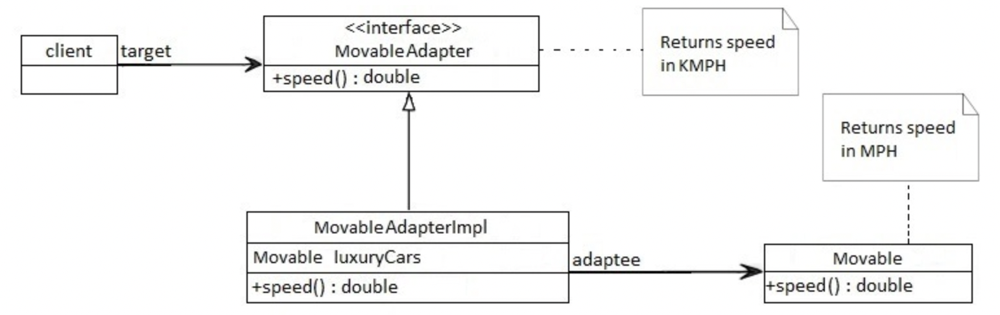
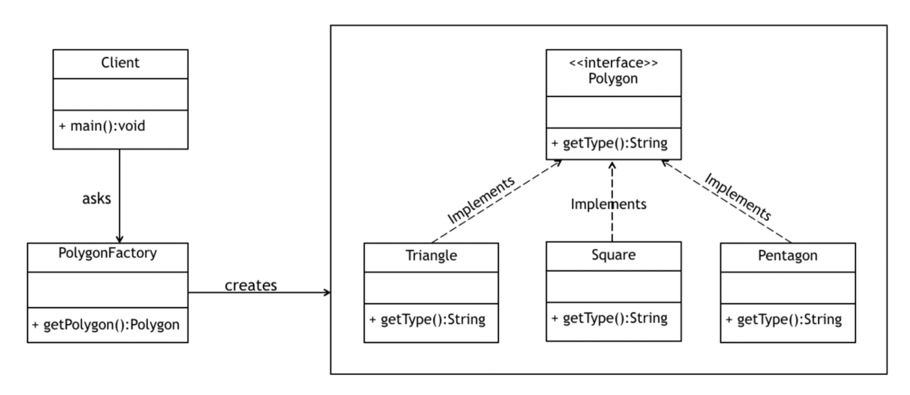

# 1. Design Patterns

## 1.1. Overview

In software engineering, a software design pattern is a general, reusable solution to a commonly occurring problem within a given context in software design. It is not a finished design that can be transformed directly into source or machine code. Rather, it is a description or template for how to solve a problem that can be used in many different situations. Design patterns are formalized best practices that the programmer can use to solve common problems when designing an application or system.

## 1.2. Singleton

In Java, Singleton is a design pattern that ensures that a class can only have one object.

To create a singleton class, a class must implement the following properties:

- Create a `private` constructor of the class to restrict object creation outside of the class.
- Create a `private` attribute of the class type that refers to the single object.
- Create a `public static` method that allows us to create and access the object we created. Inside the method, we will create a condition that restricts us from creating more than one object.

Singletons can be used while working with databases. They can be used to create a connection pool to access the database while reusing the same connection for all the clients. For example,

```java
class Database {
   private static Database dbObject;

   private Database() {
   }

   public static Database getInstance() {

      // create object if it's not already created
      if(dbObject == null) {
         dbObject = new Database();
      }

       // returns the singleton object
       return dbObject;
   }

   public void getConnection() {
       System.out.println("You are now connected to the database.");
   }
}

class Main {
   public static void main(String[] args) {
      Database db1;

      // refers to the only object of Database
      db1= Database.getInstance();

      db1.getConnection();
   }
}
```

## 1.3. Adapter

An Adapter pattern acts as a connector between two incompatible interfaces that otherwise cannot be connected directly. An Adapter wraps an existing class with a new interface so that it becomes compatible with the client’s interface.

The main motive behind using this pattern is to convert an existing interface into another interface that the client expects. It's usually implemented once the application is designed.

### 1.3.1. Adapter Example

Consider a scenario in which there is an app that's developed in the US which returns the top speed of luxury cars in miles per hour (MPH). Now we need to use the same app for our client in the UK that wants the same results but in kilometers per hour (km/h).

To deal with this problem, we'll create an adapter which will convert the values and give us the desired results:



First, we'll create the original interface Movable which is supposed to return the speed of some luxury cars in miles per hour:

```java
public interface Movable {
    // returns speed in MPH
    double getSpeed();
}
```

We'll now create one concrete implementation of this interface:

```java
public class BugattiVeyron implements Movable {

    @Override
    public double getSpeed() {
        return 268;
    }
}
```

Now we'll create an adapter interface MovableAdapter that will be based on the same Movable class. It may be slightly modified to yield different results in different scenarios:

```java
public interface MovableAdapter {
    // returns speed in KM/H
    double getSpeed();
}
```

The implementation of this interface will consist of private method convertMPHtoKMPH() that will be used for the conversion:

```java
public class MovableAdapterImpl implements MovableAdapter {
    private Movable luxuryCars;

    // standard constructors

    @Override
    public double getSpeed() {
        return convertMPHtoKMPH(luxuryCars.getSpeed());
    }

    private double convertMPHtoKMPH(double mph) {
        return mph * 1.60934;
    }
}
```

Now we'll only use the methods defined in our Adapter, and we'll get the converted speeds. In this case, the following assertion will be true:

```java
@Test
public void whenConvertingMPHToKMPH_thenSuccessfullyConverted() {
    Movable bugattiVeyron = new BugattiVeyron();
    MovableAdapter bugattiVeyronAdapter = new MovableAdapterImpl(bugattiVeyron);

    assertEquals(bugattiVeyronAdapter.getSpeed(), 431.30312, 0.00001);
}
```

As we can notice here, our adapter converts 268 mph to 431 km/h for this particular case.

### 1.3.2. When to Use Adapter Pattern

- When an outside component provides captivating functionality that we'd like to reuse, but it's incompatible with our current application. A suitable Adapter can be developed to make them compatible with each other
- When our application is not compatible with the interface that our client is expecting
- When we want to reuse legacy code in our application without making any modification in the original code

## 1.4. Factory

The Factory Design Pattern or Factory Method Design Pattern is one of the most used design patterns in Java.

According to GoF, this pattern “defines an interface for creating an object, but let subclasses decide which class to instantiate. The Factory method lets a class defer instantiation to subclasses”.

This pattern delegates the responsibility of initializing a class from the client to a particular factory class by creating a type of virtual constructor.

To achieve this, we rely on a factory which provides us with the objects, hiding the actual implementation details. The created objects are accessed using a common interface.

### 1.4.1. Factory Example

In this example, we'll create a Polygon interface which will be implemented by several concrete classes. A PolygonFactory will be used to fetch objects from this family:



Let's first create the Polygon interface:

```java
public interface Polygon {
    String getType();
}
```

Next, we'll create a few implementations like Square, Triangle, etc. that implement this interface and return an object of Polygon type.

Now we can create a factory that takes the number of sides as an argument and returns the appropriate implementation of this interface:

```java
public class PolygonFactory {
    public Polygon getPolygon(int numberOfSides) {
        if(numberOfSides == 3) {
            return new Triangle();
        }
        if(numberOfSides == 4) {
            return new Square();
        }
        if(numberOfSides == 5) {
            return new Pentagon();
        }
        if(numberOfSides == 7) {
            return new Heptagon();
        }
        else if(numberOfSides == 8) {
            return new Octagon();
        }
        return null;
    }
}
```

Notice how the client can rely on this factory to give us an appropriate Polygon, without having to initialize the object directly.

### 1.4.2. When to Use Factory Pattern

- When the implementation of an interface or an abstract class is expected to change frequently
- When the current implementation cannot comfortably accommodate new change
- When the initialization process is relatively simple, and the constructor only requires a handful of parameters
